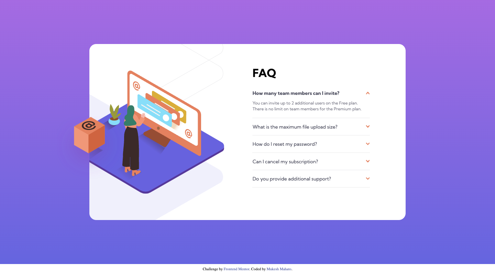

# Frontend Mentor - FAQ accordion card

## Welcome! 👋

## Table of content

-  [Overview](#Overview)
-  [Screenshot](#Screenshot)
-  [Links](#links)
-  [Build With](#⚙-built-with)
-  [Author](#author)

## Overview

This is a solution to the [FAQ accordion card challenge on Frontend Mentor](https://www.frontendmentor.io/challenges/faq-accordion-card-XlyjD0Oam). Frontend Mentor challenges help you improve your coding skills by building realistic projects.

## Screenshot

## Links

-  Solution URL: [Click Here](https://www.frontendmentor.io/solutions/nft-preview-card-component-using-html-and-css-owVJujYs59)

-  Live Site URL: [Click Here](https://iammukeshmahato.github.io/nft-preview-card-component)

## ⚙ Built with

-  HTML
-  CSS
-  JavaScript
-  Flexbox

## Author

-  Website - [myselfmukesh.blogspot.com](https://myselfmukesh.blogspot.com/)

-  Frontend Mentor - [@iammukeshmahato](https://www.frontendmentor.io/profile/iammukeshmahato)

-  Facebook - [@iammukeshmahato](https://www.facebook.com/iammukeshmahato)
